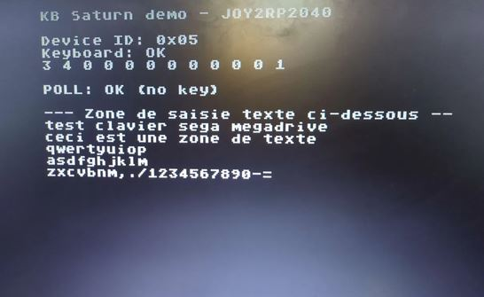

# Saturn Keyboard Adapter (RP2040)

> Use any standard USB keyboard as a Saturn Keyboard on your Mega Drive / Mega-CD.

  

---

## 🧠 Overview

This module lets a standard USB keyboard emulate a genuine **Saturn Keyboard** on the Mega Drive controller port, using the same TH/TR/TL protocol family as the [Sega Mouse adapter](../sega-mouse) in this repo.

- **Core 0** emulates the Saturn Keyboard protocol on the DB9 port
- **Core 1** reads the USB keyboard via USB Host (TinyUSB), translating HID scancodes to Saturn scancodes

---

## 🔌 Protocol

Unlike the Sega Mouse (9-nibble packet), the Saturn Keyboard exchanges **12 nibbles** per cycle over the same TH/TR/TL handshake lines. Each nibble exchange follows the same TR-toggle acknowledgment scheme:

| Nibble(s) | Content |
|---|---|
| 0–1 | Device ID (`0x34` — identifies the peripheral as a keyboard to the console) |
| 2–6 | Reserved / always zero |
| 7 | Make (`0x8`) or Break (`0x1`) event flag |
| 8–9 | Saturn scancode (translated from the USB HID keycode) |
| 10 | Reserved / always zero |
| 11 | Idle marker (`0x1`) |

When no key event is pending, the firmware sends an all-idle packet rather than skipping the exchange — this keeps the console's polling happy and avoids the abandoned-packet issue documented in the [Sega Mouse notes](../sega-mouse/docs).

### Typematic (key repeat) emulation

To feel like a real keyboard rather than a raw USB passthrough, the firmware implements typematic repeat in software:

- **Initial delay**: ~400ms after a key is first pressed before auto-repeat kicks in
- **Repeat rate**: ~60ms between repeats once active
- A small state machine (`RPT_IDLE` / `RPT_BURST` / `RPT_WAIT`) tracks this per key, sending real idle nibbles during the wait phase (not deduplicated) — important since the tested receiver software ([SMDT](https://github.com/SweMonkey/smdt)) doesn't do its own deduplication and expects genuine idle/press cycles.

---

## 🧪 Tested with

Development and testing were done against **[SMDT](https://github.com/SweMonkey/smdt)** — a Mega Drive/Genesis terminal emulator, telnet and IRC client by SweMonkey — since it requires real interactive text input rather than just isolated key presses, making it a good stress test for the full typing experience.

  

---

## 💻 SGDK demo

The [`/sgdk`](./sgdk) folder contains a test demo (screenshot below) along with **`KB_Saturn.c`** and **`KB_Saturn.h`** — a portable driver you can drop straight into your own SGDK homebrew to add Saturn Keyboard support without reimplementing the protocol yourself.

  

---

## 🛠️ Firmware

See [`/firmware`](./firmware) for the RP2040 `.uf2` file.
Choose  Qwerty or Azerty firmware depending of your keyboard.

> 📌 Same closed-source-for-now policy as the [Sega Mouse adapter](../sega-mouse) — sources will be released publicly later.